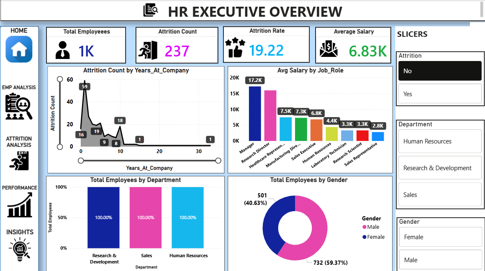
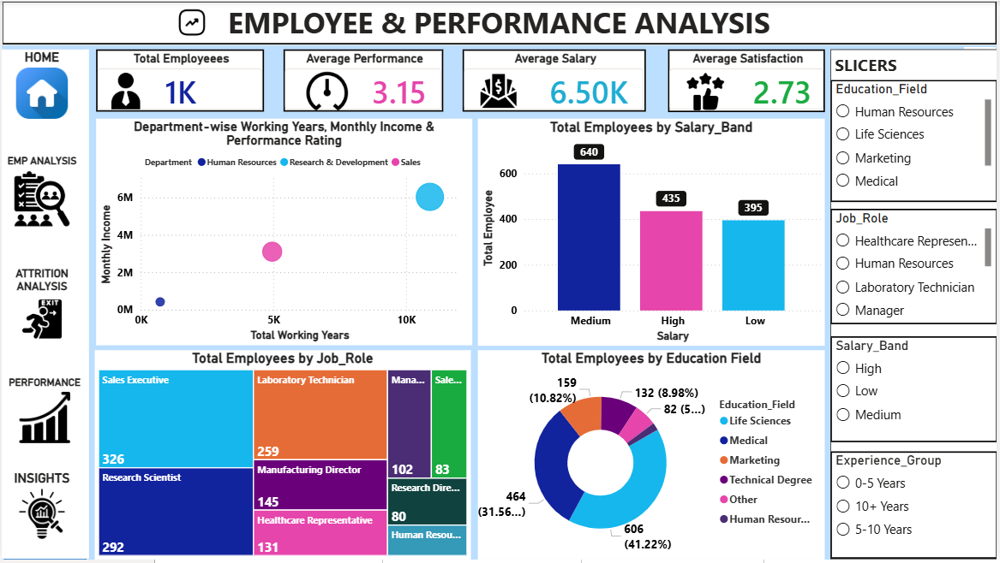
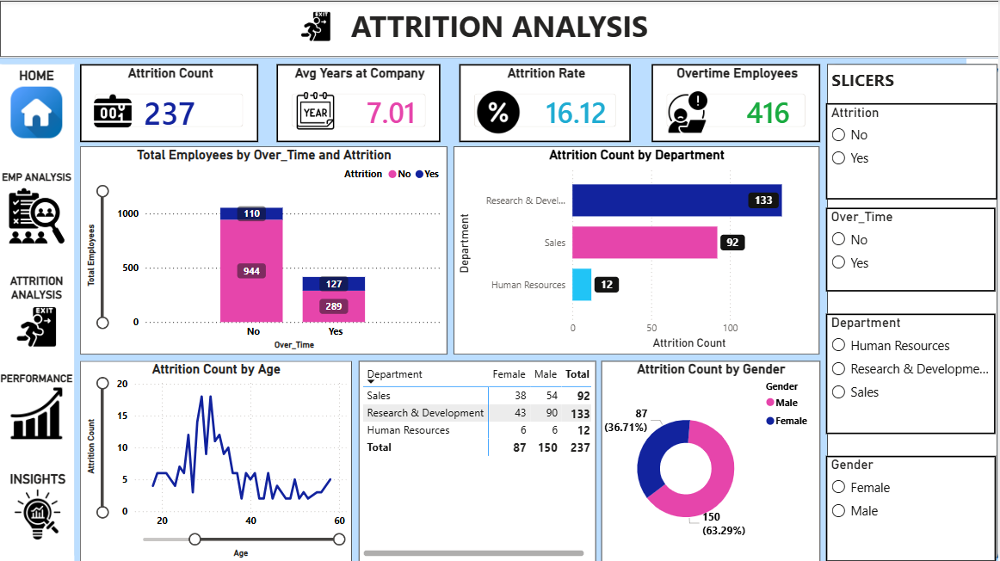
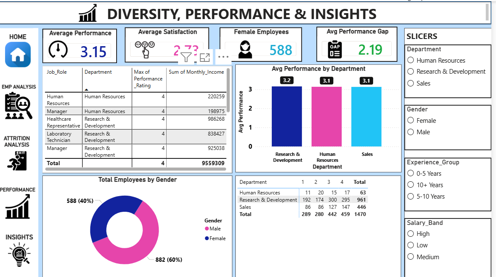
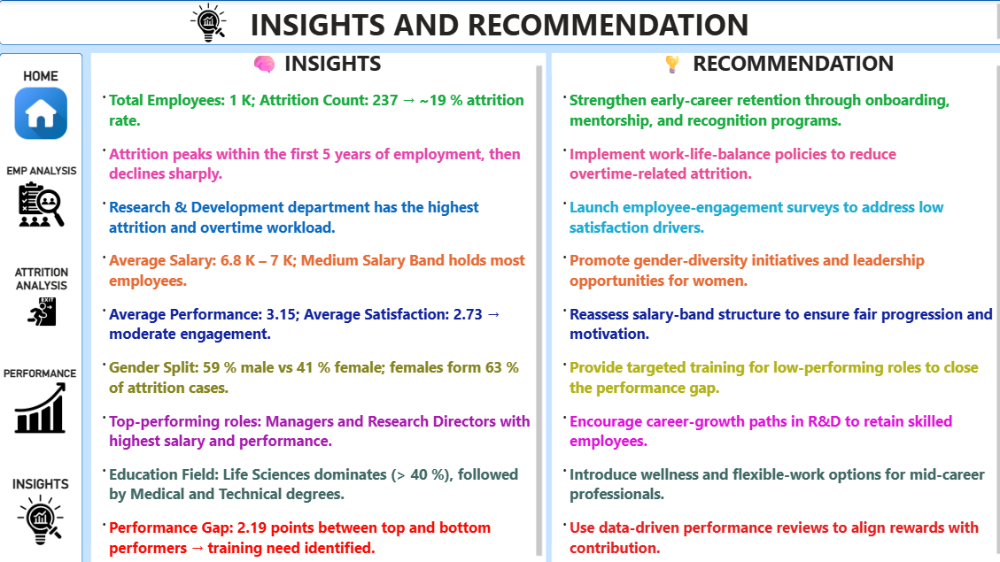

# 🚀 HR Workforce Aanalytics PowerBI SQL


<div align="center">


## 📊 End-to-End HR Analytics Project

### Employee Attrition • Workforce Insights • Performance Analysis • Diversity Analytics

</div>

---

# 📌 Project Overview

This project is a complete **HR Workforce Analytics Dashboard** developed using **Power BI, SQL, Excel, and Data Visualization techniques**.

The dashboard helps HR teams and business leaders analyze:

* Employee Attrition
* Workforce Distribution
* Department Analysis
* Gender Diversity
* Salary Trends
* Employee Performance
* Promotion Insights
* Employee Satisfaction
* Workforce Demographics

The goal of this project is to convert raw HR data into meaningful business insights for better decision-making.

---

# 🛠️ Tools & Technologies Used

<div align="center">

| Tool                                                                                      | Purpose                            |
| ----------------------------------------------------------------------------------------- | ---------------------------------- |
|  | Dashboard Creation & Visualization |
|                | Data Analysis & Querying           |
|  | Data Cleaning & Preprocessing      |
|                           | KPI Measures & Calculations        |
|                      | Business Insights                  |
|                   | Interactive Reporting              |

</div>

---

# 📂 Project Structure

```bash
📁 Strategic-HR-Workforce-Analytics
│
├── 📊 HR Data.xlsx
├── 🖼️ hr_dashboard_image1.png
├── 🖼️ hr_dashboard_image2.png
├── 🖼️ hr_dashboard_image3.png
├── 🖼️ hr_dashboard_image4.png
├── 🖼️ hr_dashboard_image5.png
├── 🗄️ HR_data_analysis_sql.sql
├── 📄 PROJECT - 3.pbix
├── 📘 Strategic-HR-Workforce-Analytics.pdf
└── 📄 README.md
```

---

# 🎯 Business Problem

Organizations face several HR challenges such as:

* High employee attrition
* Poor workforce visibility
* Salary imbalance
* Department-wise performance gaps
* Promotion delays
* Lack of diversity insights

This dashboard solves these problems by providing a centralized HR analytics solution.

---

# 📈 Dashboard Features

## ✅ KPI Cards

* Total Employees
* Attrition Count
* Attrition Rate
* Average Salary
* Average Age
* Average Performance Rating
* Promotion Gap
* Satisfaction Score

---

## 📊 Dashboard Visuals

### Employee Overview

* Employee Count by Department
* Employee Count by Gender
* Employee Distribution by Education
* Age Group Analysis

### Attrition Analysis

* Attrition by Department
* Attrition vs Years at Company
* Attrition by Job Role
* Attrition by Salary Slab

### Performance Analysis

* Department Performance
* High Performers Analysis
* Promotion Insights
* Experience vs Salary Analysis

### Workforce Diversity

* Gender Diversity Dashboard
* Marital Status Analysis
* Education Background Analysis

---

# 📷 Dashboard Preview

## 🖥️ HR Dashboard Screens

### Dashboard Page 1



---

### Dashboard Page 2



---

### Dashboard Page 3



---

### Dashboard Page 4



---

### Dashboard Page 5



---

# 📌 Important Power BI Measures (DAX)

## Employee Count

```DAX
Employee Count =
DISTINCTCOUNT(Employee[EmployeeID])
```

## Attrition Count

```DAX
Attrition Count =
CALCULATE(
    [Employee Count],
    Employee[Attrition] = "Yes"
)
```

## Attrition Rate

```DAX
Attrition Rate =
DIVIDE([Attrition Count], [Employee Count]) * 100
```

---

# 🗄️ SQL Analysis Included

This project also contains SQL analysis queries for:

* Employee Count Analysis
* Department-wise Distribution
* Salary Insights
* Attrition Analysis
* Performance Metrics
* Workforce Segmentation

---

# 📊 Key Insights Generated

✅ Departments with highest attrition

✅ Salary trends across job roles

✅ Gender diversity ratio

✅ Employees likely to leave organization

✅ Performance vs Experience relationship

✅ Promotion and satisfaction analysis

---

# 🔥 Skills Demonstrated

<div align="center">


</div>

---

# 💼 Project Use Cases

This dashboard can be used by:

* HR Managers
* Business Analysts
* Data Analysts
* Workforce Planning Teams
* Recruitment Teams
* Corporate Decision Makers

---

# 🚀 How to Use

## Step 1

Download or clone the repository.

## Step 2

Open the `.pbix` file in Power BI Desktop.

## Step 3

Refresh the dataset connection.

## Step 4

Explore interactive filters, KPIs, and charts.

---

# 🌟 Future Improvements

* AI-based Attrition Prediction
* Real-time HR Monitoring
* Employee Recommendation System
* Automated HR Reporting
* Cloud Deployment
* Advanced Workforce Forecasting

---

# 📚 Learning Outcomes

Through this project, you will learn:

* Power BI Dashboard Development
* DAX Measures
* SQL Analytics
* Data Cleaning
* HR Analytics Concepts
* Interactive Data Visualization
* Business Intelligence Reporting

---

# 👨‍💻 Author

## SANJU VERMA

### Aspiring Data Analyst | Power BI Developer | SQL Enthusiast

---

# ⭐ Support

If you found this project helpful:

⭐ Star this repository

🍴 Fork the repository

📢 Share with others

---

# 📜 License

This project is for educational and portfolio purposes.

---

<div align="center">

# 🚀 Transforming HR Data into Business Intelligence

### Built with ❤️ using Power BI, SQL & Excel

</div>
